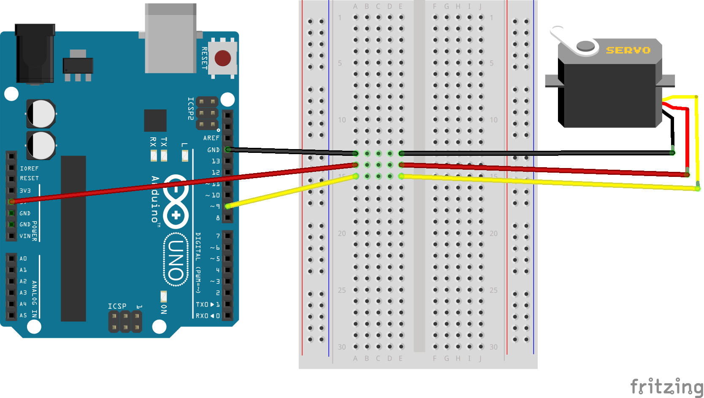

# Arduino ServoSwervo
Sero example using Arduino.

### Components
1. [Arduino Uno R3](https://www.adafruit.com/product/2488)
2. [Micro Servo](https://www.adafruit.com/product/169)
3. [Breadboarding Wires](https://www.adafruit.com/product/153)

### Schematic

